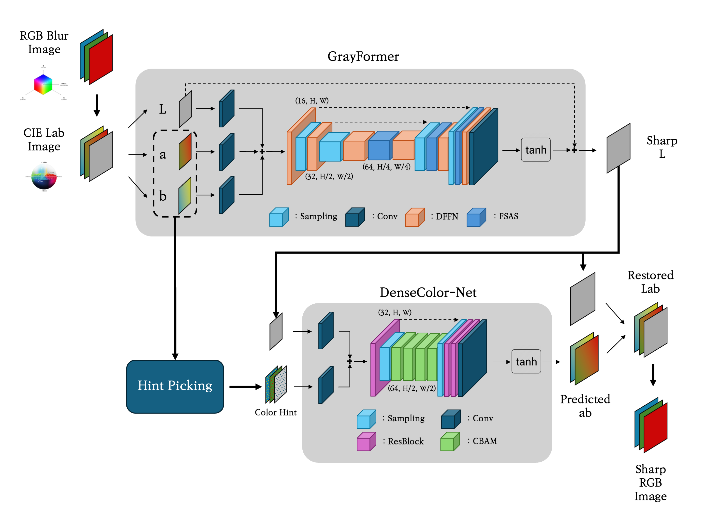

# FastDeblur-Net

This is a PyTorch implementation of a lightweight deblurring model
of [FFTformer](https://openaccess.thecvf.com/content/CVPR2023/papers/Kong_Efficient_Frequency_Domain-Based_Transformers_for_High-Quality_Image_Deblurring_CVPR_2023_paper.pdf).

## How to run

This project is developed on pipenv environment. The PyTorch used on this project is CUDA 11.8 Windows version. If you
want to run this project in different environment, you should modify PyTorch source info in Pipfile. The proper url is
provided in [PyTorch Get Started page](https://pytorch.org/get-started/locally/)

```
[[source]]
url = "https://download.pytorch.org/whl/cu118"
verify_ssl = false
name = "pytorch"
```

If you properly set PyTorch version, you should configure python environment by running
the following command.

```bash
pipenv install
pipenv shell
```

Then, you can run this program. If you put blurred images in "dataset/images" folder, The sharpen image is generated
in "results/images" folder.

```bash
python3 main.py
```

## Architecture



First of all, this model process blurred color image into sharp grayscale image. Rather than the original
model called FFTformer, this model has smaller inference information. (RGB channel(3) > Grayscale channel(1)) This make
the inference time to be faster. Then, we can perform colorization step of sharp grayscale image fast because we have
blur image as rich color information.

## Experiment Result

Test dataset: [GoPro dataset](https://seungjunnah.github.io/Datasets/gopro)

|                                       | MACs(G)   | parameter count(M) |
|---------------------------------------|-----------|--------------------|
| FFTformer                             | 131.54    | 14.88              |
| Grayformer[Ours]                      | 16.42     | 1.78               |
| DenseColor-Net[Ours]                  | 8.80      | 0.36               |
| **Grayformer + DenseColor-Net[Ours]** | **25.22** | **2.14**           |

|           | PSNR(dB)  | GPU inference time(ms) |
|-----------|-----------|------------------------|
| FFTformer | 29.70     | 126.84                 |
| **Ours**  | **30.02** | **54.00**              |
